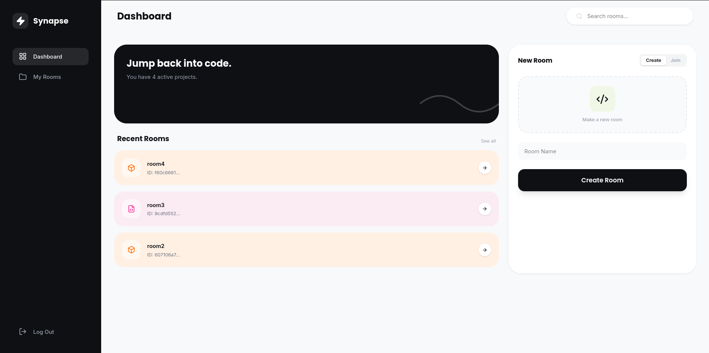

# Synapse: Real-Time Collaborative Code Editor

**Synapse** is a real-time collaborative code editor that allows developers to code together in perfect sync. Built with the MERN stack and powered by Yjs for conflict-free collaboration, it features a sleek UI, secure code execution via the Piston API, and an VS Code-like editing experience.

---

## Screenshots

| **Dashboard** |
|:---:|
|  <br> *Secure Login & Room Management* |
| **Collaborative Editor** |
|  <br> *Real-time Editing with Terminal Output* |

---

## Features

- **Real-Time Collaboration**: Multi-user editing with sub-millisecond latency using **Yjs** & **WebSockets**.
- **Modern UI**: Beautiful, responsive interface built with **React**, **Tailwind CSS**, and **Lucide Icons**.
- **Code Execution**: Secure, sandboxed code execution for JS, Python, Java, and C++ via the **Piston API**.
- **File System**: Create, delete, and switch between multiple files within a single room.
- **Presence Awareness**: See who is online and track their cursors in real-time with color-coded indicators.
- **Authentication**: Secure user accounts with JWT-based stateless authentication.
- **Persistence**: Auto-save and manual save functionality to MongoDB.

---

## Tech Stack

### **Frontend**
- **Framework**: React.js (Vite)
- **Styling**: Tailwind CSS v4
- **Editor**: Monaco Editor (`@monaco-editor/react`)
- **Collaboration**: Yjs, `y-websocket`, `y-monaco`
- **State/Routing**: React Router DOM, Context API

### **Backend**
- **Runtime**: Node.js & Express.js
- **Database**: MongoDB (Atlas)
- **Real-time**: `ws` (WebSocket) library
- **Security**: BCrypt (Hashing), JWT, CORS

---

## Getting Started

Follow these steps to run Synapse locally.

### **Prerequisites**
- Node.js (v18+)
- MongoDB Atlas Connection String

### **1. Clone the Repository**
```bash
git clone [https://github.com/atta-ullah01/synapse.git](https://github.com/atta-ullah01/synapse.git)
cd synapse
```

### **2. Backend Setup**
Navigate to the server directory and install dependencies:
```bash
cd server
npm install
```

Create a `.env` file in the `server` directory:
```env
PORT=5000
MONGO_URI=your_mongodb_connection_string
JWT_SECRET=your_jwt_secret_key
```

Start the server:
```bash
npm run dev
```

### **3. Frontend Setup**
Open a new terminal, navigate to the client directory, and install dependencies:
```bash
cd ../client
npm install
```

Create a `.env` file in the `client` directory:
```env
VITE_API_URL=http://localhost:5000
```

Start the frontend:
```bash
npm run dev
```

Visit `http://localhost:5173` in your browser.

---

## Project Structure

```text
synapse/
├── client/              # React Frontend
│   ├── src/
│   │   ├── pages/       # Auth, Dashboard, EditorPage
│   │   ├── components/  # Reusable UI components
│   │   └── index.css    # Tailwind Imports & Global Styles
│   └── ...
├── server/              # Node.js Backend
│   ├── models/          # Mongoose Schemas (User, Room)
│   ├── routes/          # API Routes (Auth, Room, Execute)
│   ├── server.js         # Entry point (Express + WebSocket setup)
│   └── ...
└── README.md
```
